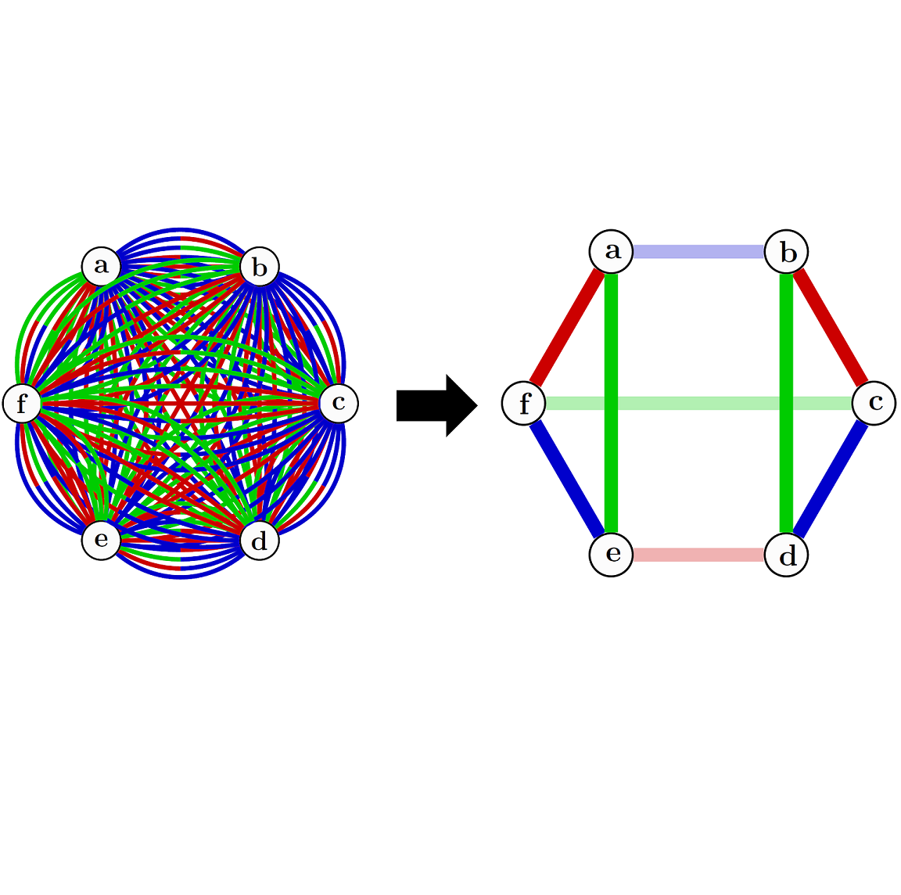

# Conceptual understanding through efficient inverse-design of quantum optical experiments
### Code for the paper: https://arxiv.org/abs/2005.06443
### Mario Krenn, Jakob Kottmann, Nora Tischler, Alán Aspuru-Guzik
#### contact: mario.krenn@utoronto.ca and alan@aspuru.com

Theseus is an efficient algorithm for the design of quantum experiments, which we use to solve several open questions in experimental quantum optics. The algorithm' core is a physics-inspired, graph-theoretical representation of quantum states, which makes it significantly faster than previous comparable approaches. The gain in speed allows for topological optimization, leading to a reduction of the experiment to its conceptual core.

The code is written in Mathematica, because operations on the graph are performed symbolically, and Mathematica has efficient solvers for nonlinear optimization problems.

## Examples
We provide a number of examples, both for the discovery of new quantum experiments -- using post-selected, non-postselected state generation and quantum transformation.

* [Post-selected high-dimensional three-photon entanglement](https://github.com/aspuru-guzik-group/Theseus/blob/master/examples/FindSRVStates.m): Discovery of maximally entangled Schmidt-Rank Vector states.

* [Heralded three-dimensional Bell State](https://github.com/aspuru-guzik-group/Theseus/blob/master/examples/FindHeralded3dBellState.m): Discovery of heralded Bell states, goes beyond of post-selection.

* [Two-qubit CNOT gate](https://github.com/aspuru-guzik-group/Theseus/blob/master/examples/Find2dCNOT.m): Discovery of photon-photon CNOT gates. Introduction of virtual vertices.

* [Translation of Quantum Experiment to Graph](https://github.com/aspuru-guzik-group/Theseus/blob/master/examples/TranslateExperimentToGraph.m): Transforming an quantum optical setup (a photonic CNOT by Gasparoni et al., PRL 93, 020504 (2014)) in an automated way to graphs.

You can download all examples as standard [Mathematica notebooks](https://github.com/aspuru-guzik-group/Theseus/blob/master/examples/QuantumTheseus_20200517.zip).

